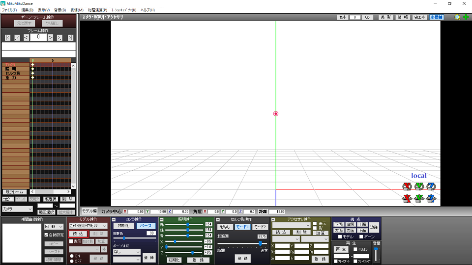
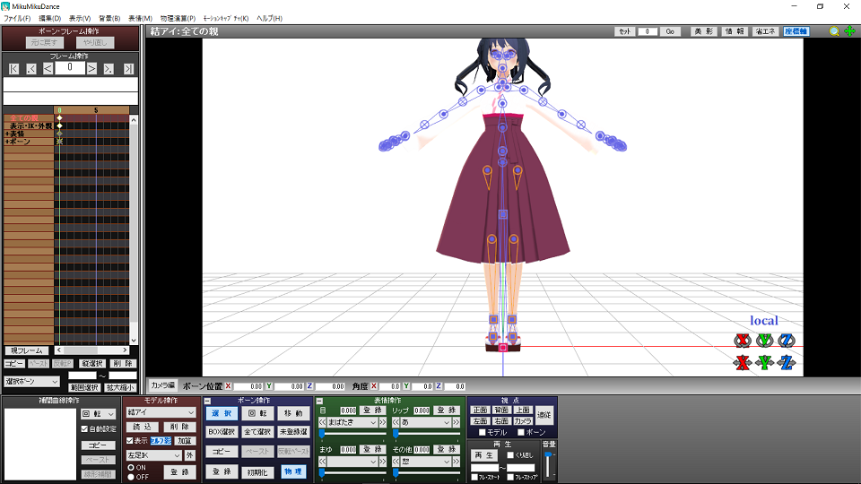
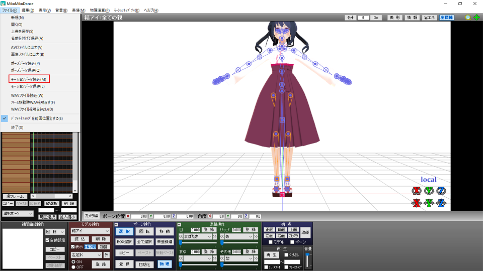
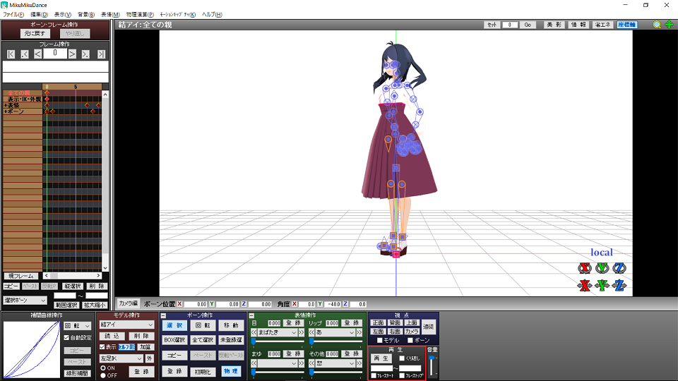

<!-- Markdown: Open Preview to the side -->
# MMDアイちゃんの説明
## ファイルの中身確認
haihuの中に入ってる物は以下の通りです。
```
haihu
  ┗ musubiai2.0
       ┗ PmxView
            ┗ aichan.x (小道具類のファイル)
       ┗ tex (テクスチャファイル)
       ┗ aichan.pmx (ボーンを少しいじった)
       ┗ musubiai.fx (エフェクトとか。)
       ┗ musubiai2.0.pmx (変換してそのまんま)
  ┗ aichan_motion
         ┗ tewohuruyatu.vmd (もーしょん)
  ┗ gazou (説明用画像)
```
***
## ファイルの詳細とかいろいろ

たぶん見たことないファイル形式があるので一応説明を


### aichan.x の xファイル ... アクセサリファイル   
初音ミクとかでいうところのネギであったり、   
ステージ上の細かな小道具などを使用するため。   

### texの中身 ... アイちゃんの外見を作る肌みたいなもん   
基本は**いじらない**こと。   
万が一消しちゃったらやべえアイちゃんが出ます。  　

### musubiai.fx の fxファイル ... エフェクト   
服の模様とか、キラキラした何かを付け加えるとか。   
ぶっちゃけ無くても出来上がりますが、あったほうが綺麗です。

### tewohuruyatu.vmd の vmdファイル ... motion
読み込んだモデルに動きを付けます。   
MMDアイちゃんは大体のモーションに対応できます。   
ただし、人外(クリーチャーとか怪獣とか)モーションはムリでーす。

### aichan.pmxとmusubiai2.0.pmx の pmxファイル　... 骨組み   
骨格だと思ってください。   
これがないと上記のものが意味ないファイルです。   
消しちゃったら迷うことなく全部削除してzipを再解凍しちゃってください。   
    
### Q : そもそもどれがメインなの
A : pmxファイルです。   
MMD等でモデル読み込みをする際には**pmx**を読み込んでください。
### Q : texファイルの中身をpmxと同じ階層に置きたいんやけど
A : やったことないのでわかりません。試してください。   
vmdの制作でテクスチャファイルをどこの階層に置くかは作り方次第です。   
自分はごちゃごちゃしてだるいなと思ってテクスチャファイルをまとめちゃってます。   
### Q : aichan.pmx と musibiai2.0.pmxの違いは何？
A : _end3 と書いてあるボーンがあるかないかです。   
今回、VRoidからMMDに変換しており、その際に出てる_end3というボーンは邪魔でしかないです。   
というか、vmdで使用することがまずないので消してます。
***
## MMDのダウンロード
まずはMikuMikuDanceをダウンロードするところからです。   
[こちら](https://drive.google.com/uc?id=1XurGlDnQy-EfpO13JcqCocQhjuHtXx6P&export=download)からダウンロードしてください。   
ダウンロードしたファイルの中身は以下のようになってると思います
```
MikuMikuDance_v○○○
     ┗ Data (ミクのトーンとか)
     ┗ UserFile (サンプルとかいろいろ)
     ┗ MikuMikuDance.exe (実行ファイル)
     ┗ readme.txt 
```
まずはMikuMi.exeを実行してみてください。   
こんな感じの画面が出ると思います。   
    
ひとまずこの画面が開けれたらokです。   
仮にエラーが出て開けないんやけどとかは   
***サイドバイサイド構成エラー***の可能性大なのでそこをクリアしてください。   

エラーが出なかった、クリアしたら次にモデルのアイちゃんをここに登場させてみましょう。
## アイちゃん召喚　(pmx読み込み)
下のなんかカラフルに並んでる意味不明な奴らの   
赤い枠のモデル操作の中に読み込みというのがあるので、   
そこにaichan.pmxかmusubiai2.0.pmxを開きましょう。   
読み込む際に作成者のポップが出ると思いますがokでいいです。

　　　　　　　　　　　　　↓

上のようにアイちゃんが手を横に伸ばしてる感じで読まれてたらokです。  
もし、足元が変やでとかあれば別のpmxを読み込んでそっちもおかしいんやけどとかであればメールを送ってください。直します。   

ひとまず召喚ができました。   
がこれでは変な骨組みが見えてるアイちゃんを眺めるだけになるので   
次は動かしてみましょう。

## アイ、動きます。　(vmd読み込み)
まずは左上のファイルのタブを開いてみましょう。   
そしたらこんな感じのやつが出るので赤い枠のをクリック

ついででポーズデータってなんや？とかモーションデータ保存ってなんや？という疑問を解消しときます。   
ポーズデータは握り方とか手をピース✌にしたりとか細かな部分のデータです。基本的にモーションを組み合わせて使います。単体で使うとしたら何かポーズをさせて撮影する程度。   

モーションデータ保存はポーズデータやら連続して別の動きをしたりとか、表情操作とかを別のモデルでもしたいよ！ていう時に使う。


では、vmd読み込みに戻ります。   
読み込みを押したらファイル選択画面が出ると思うので   
tewohuruyatu.vmdを試しに開いてみてください。   
なんとかハサン専用やで！と言われますが、無問題なのでそのままokを押してください。

変化したと思います。   
左側のフレーム操作枠を見てもらえたら赤い粒粒が出てるのがわかります。   
その粒粒を通過するたびにボーン操作が行われて動きがついてる感じ。
あとは再生です。   
下のカラフルな枠達の右下、少し黒っぽい枠です

赤い枠で囲っているところの再生を押したら動き出します。   
このモーションはちょっと長めですけどうまーいこと動いてるので　　　ボーンの枠とかも見てください。


以上 MMDの基本的な操作でした。
***
